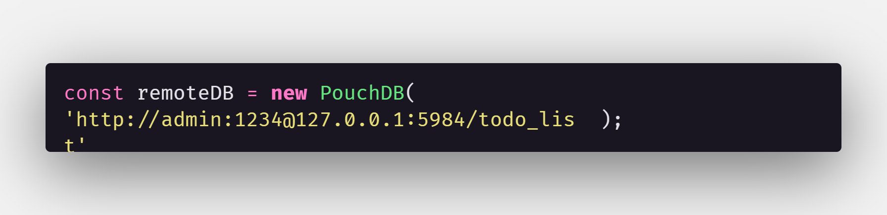

#Abordagem de testes Couch-Pouch DB

##Abordagem 1
- Usando CouchDB tanto no cliente quanto no servidor
####Branch <i>couchOnly</i>
##Abordagem 2
- Usando PouchDB no cliente e CouchDB no servidor
####Branch <i>main</i>

####Comparação
Em termos de mudanças, a única e significativa mudança da abordagem 2 (<i>main</i>) para a abordagem 1 (<i>couchOnly</i>)
é a remoção da rota <b><i>Sync</i></b>, a qual não há mais necessidade devida conexão direta com o banco remoto.
Em código temos também a remoção da instância do banco local

- Abordagem 01 (<i>couchOnly</i>)

- Abordagem 02 (<i>main</i>)

###### Com a mudança da instância, todas as operações crud também são alteradas, ao invés de utilizar <i>localDB.(func)</i>, utilizam <i>remoteDB.(func)</i>